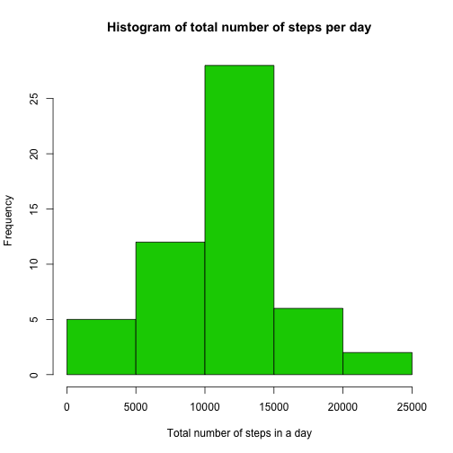
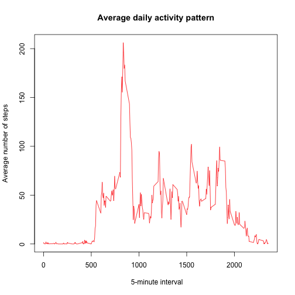
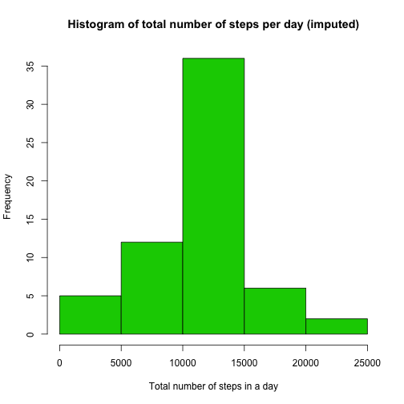
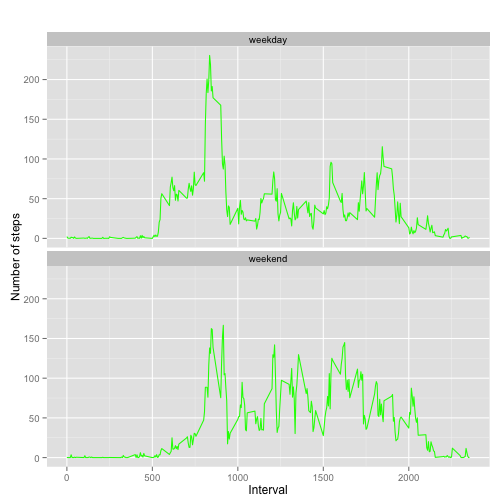

## Loading and preprocessing the data

```r
library(plyr)
#Loading and preprocessing the data
unzip(zipfile="activity.zip",exdir="./",overwrite=TRUE)
data<-read.csv('activity.csv',header=TRUE)
data1<-na.omit(data)
```


#What is mean total number of steps taken per day?

```r
total.steps<-aggregate(steps ~ date,data1,sum)

#Histogram of the total number of steps taken each day
hist(total.steps$steps,main="Histogram of total number of steps per day",xlab="Total number of steps in a day",col=3)
```

 

```r
#Calculate and report the mean and median of the total number of steps taken per day
mean_steps<-round(mean(total.steps$steps))
median_steps<-median(total.steps$steps)
```
The mean of total number of steps is 1.0766 &times; 10<sup>4</sup> .  
The median of total number of steps is 10765 .

## What is the average daily activity pattern?

```r
avg.steps<-aggregate(steps ~ interval,data1,mean)
plot(avg.steps$interval,avg.steps$steps,type="l",main="Average daily activity pattern",xlab=" 5-minute interval",ylab="Average number of steps",col=2)
```

 

```r
#Which 5-minute interval, on average across all the days in the dataset, contains the #maximum number of steps?
max_step<-which.max(avg.steps$steps)
interval_val<-avg.steps[max_step,]$interval
```

The 5-minute interval which contains the maximum number of steps is 835.


## Imputing missing values


```r
#Imputing missing values
total_na<-sum(is.na(data))
```
Total number of missing values in the dataset is 2304.

## Are there differences in activity patterns between weekdays and weekends?

```r
#Imputing missing values
#duplicate original data
imputed_data<-data
#replacing missing value with average number of steps per interval
for (i in 1:nrow(imputed_data))
     {
  if (is.na(imputed_data$steps[i])) 
    {
   
    steps_navalue <- avg.steps[
      avg.steps$interval == imputed_data$interval[i],]
    imputed_data$steps[i] <- steps_navalue$steps
  }
}
##total number of steps taken each day
new.total.steps<-aggregate(steps~date,imputed_data,sum)
##Histogram of the total number of steps taken each day
hist(new.total.steps$steps, main="Histogram of total number of steps per day (imputed)", 
     xlab="Total number of steps in a day",col=3)
```

 

```r
## mean and median total number of steps taken per day after imputation
new_mean_steps<-mean(new.total.steps$steps)
new_median_steps <-median(new.total.steps$steps)
```
The mean and median of the total number of steps per day after imputation is 1.0766189 &times; 10<sup>4</sup> and 1.0766189 &times; 10<sup>4</sup> respectively.  
The  mean and median of total number of steps per day with missing values is 1.0766 &times; 10<sup>4</sup>
and 10765 respectively.  
After imputing missing values , the median of the total number of steps per day increased to 1.0766189 &times; 10<sup>4</sup> and mean remain same.


```r
#Are there differences in activity patterns between weekdays and weekends?
imputed_data$type_of_day<-weekdays(as.Date(imputed_data$date))
imputed_data$type_of_day[imputed_data$type_of_day  %in% c('Saturday','Sunday') ] <- "weekend"
imputed_data$type_of_day[imputed_data$type_of_day != "weekend"] <- "weekday"

#Create a new factor variable in the dataset with two levels – “weekday” and “weekend” 
imputed_data$type_of_day <- as.factor(imputed_data$type_of_day)

#aggregate steps as interval to get average number of steps in an interval across all days
imputed_agg_steps<-aggregate(steps ~interval+type_of_day,imputed_data,mean)

#Make a panel plot containing a time series plot (i.e. type = "l") of the 5-minute interval #(x-axis) and the average number of steps taken, averaged across all weekday days or weekend #days (y-axis).
library(ggplot2)
qplot(interval, steps, data=imputed_agg_steps, geom=c("line"), xlab="Interval", colour=I("green"),
      ylab="Number of steps",main="") + facet_wrap(~ type_of_day, ncol=1)
```

 

